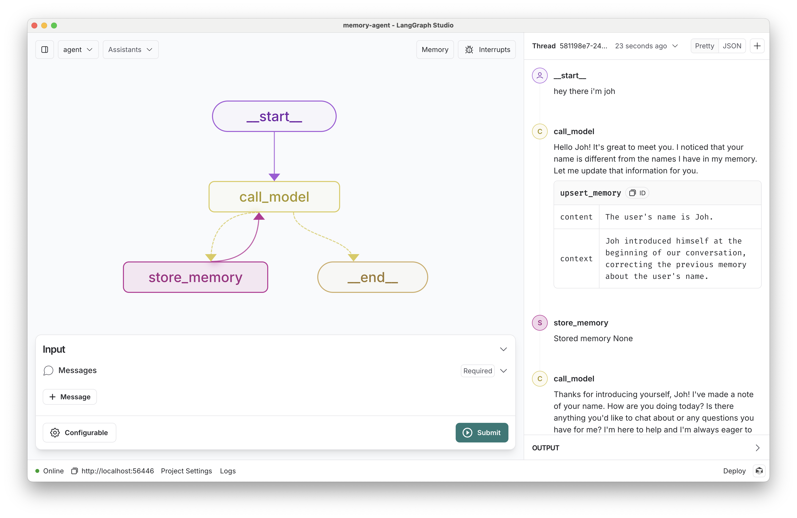
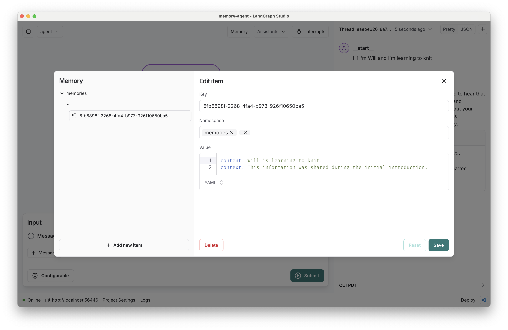

# AI-Nexus Agent

[](https://github.com/langchain-ai/memory-agent/actions/workflows/unit-tests.yml)
[](https://github.com/langchain-ai/memory-agent/actions/workflows/integration-tests.yml)
[![Open in - LangGraph Studio](https://img.shields.io/badge/Open_in-LangGraph_Studio-00324d.svg?logo=data:image/svg%2bxml;base64,PHN2ZyB4bWxucz0iaHR0cDovL3d3dy53My5vcmcvMjAwMC9zdmciIHdpZHRoPSI4NS4zMzMiIGhlaWdodD0iODUuMzMzIiB2ZXJzaW9uPSIxLjAiIHZpZXdCb3g9IjAgMCA2NCA2NCI+PHBhdGggZD0iTTEzIDcuOGMtNi4zIDMuMS03LjEgNi4zLTYuOCAyNS43LjQgMjQuNi4zIDI0LjUgMjUuOSAyNC41QzU3LjUgNTggNTggNTcuNSA1OCAzMi4zIDU4IDcuMyA1Ni43IDYgMzIgNmMtMTIuOCAwLTE2LjEuMy0xOSAxLjhtMzcuNiAxNi42YzIuOCAyLjggMy40IDQuMiAzLjQgNy42cy0uNiA0LjgtMy40IDcuNkw0Ny4yIDQzSDE2LjhsLTMuNC0zLjRjLTQuOC00LjgtNC44LTEwLjQgMC0xNS4ybDMuNC0zLjRoMzAuNHoiLz48cGF0aCBkPSJNMTguOSAyNS42Yy0xLjEgMS4zLTEgMS43LjQgMi41LjkuNiAxLjcgMS44IDEuNyAyLjcgMCAxIC43IDIuOCAxLjYgNC4xIDEuNCAxLjkgMS40IDIuNS4zIDMuMi0xIC42LS42LjkgMS40LjkgMS41IDAgMi43LS41IDIuNy0xIDAtLjYgMS4xLS44IDIuNi0uNGwyLjYuNy0xLjgtMi45Yy01LjktOS4zLTkuNC0xMi4zLTExLjUtOS44TTM5IDI2YzAgMS4xLS45IDIuNS0yIDMuMi0yLjQgMS41LTIuNiAzLjQtLjUgNC4yLjguMyAyIDEuNyAyLjUgMy4xLjYgMS41IDEuNCAyLjMgMiAyIDEuNS0uOSAxLjItMy41LS40LTMuNS0yLjEgMC0yLjgtMi44LS44LTMuMyAxLjYtLjQgMS42LS41IDAtLjYtMS4xLS4xLTEuNS0uNi0xLjItMS42LjctMS43IDMuMy0yLjEgMy41LS41LjEuNS4yIDEuNi4zIDIuMiAwIC43LjkgMS40IDEuOSAxLjYgMi4xLjQgMi4zLTIuMy4yLTMuMi0uOC0uMy0yLTEuNy0yLjUtMy4xLTEuMS0zLTMtMy4zLTMtLjUiLz48L3N2Zz4=)](https://langgraph-studio.vercel.app/templates/open?githubUrl=https://github.com/langchain-ai/memory-agent)

This repo provides a simple ReAct-style agent with a tool to save memories. This is a simple way to let an agent persist important information to reuse later. In this case, we save all memories scoped to a configurable `user_id`, which lets the bot learn a user's preferences across conversational threads.



## Running Locally

### Update `.env`
Create a `.env` file.
```sh
cp .env.example .env
```

Update the following required environment variables in `.env`:
* `GOOGLE_API_KEY`

(rest may be omitted unless testing locally)


### Install uv

Install [uv](https://docs.astral.sh/uv/getting-started/installation/). It will take care of venv and python interpreters automatically.

Inside `uv`, the installed commands may be run as `uv run -- <CMD>`. 

For example LangGraph can be run via: 

```sh
uv run -- langgraph dev
```

### Run

Run the agent locally via:

```sh
make run
```

This will invoke the `sync` and `deps` targets on its own.


### Clean

```sh
make clean
```

### Example Agent Usage

`make run` should open the LangGraph with the default model to interact with. 

Navigate to the `agent_template` graph and have a conversation with it! Try sending some messages saying your name and other things the bot should remember.

Try saving memories via the `upsert_memory` tool:

```
<action> # "create memory" or "update memory"
content: The main content of the memory. For example:
         "User expressed interest in learning about French."
context: Additional context for the memory. For example:
         "This was mentioned while discussing career options in Europe."
memory_id: ONLY PROVIDE IF UPDATING AN EXISTING MEMORY.
          The memory to overwrite.
```

Example:

```
create memory
content: My name is John Doe
context: I was asked my name at the local DMV

> ... The memory ID is `ceb9b38e-7082-4eb0-b51f-05f8accbca5a`.  Is there anything else I can assist you with today?

update memory
content: My name is John Doe
context: This was mentioned because someone asked if I was Jill Dove's brother.
memory_id: ceb9b38e-7082-4eb0-b51f-05f8accbca5a
```

Assuming the bot saved some memories, create a _new_ thread using the `+` icon. Then chat with the bot again - if you've completed your setup correctly, the bot should now have access to the memories you've saved!

You can review the saved memories by clicking the "memory" button.



## Adding Agents
To experiment, 

1. Copy the `agent_template` and name it accordingly. 
2. Update package paths
3. Add new agent package in [pyproject.toml](./pyproject.toml)
4. `make run` and navigate to the agent

**Note** You can change the `default_graph` key in [langgraph.json](./langgraph.json) ***locally*** to set the default graph to open.

## How it works

This chat bot reads from your memory graph's `Store` to easily list extracted memories. If it calls a tool, LangGraph will route to the `store_memory` node to save the information to the store.

## How to evaluate

Memory management can be challenging to get right, especially if you add additional tools for the bot to choose between.
To tune the frequency and quality of memories your bot is saving, we recommend starting from an evaluation set, adding to it over time as you find and address common errors in your service.

We have provided a few example evaluation cases in [the test file here](./tests/integration_tests/test_graph.py). As you can see, the metrics themselves don't have to be terribly complicated, especially not at the outset.

We use [LangSmith's @unit decorator](https://docs.smith.langchain.com/how_to_guides/evaluation/unit_testing#write-a-test) to sync all the evaluations to LangSmith so you can better optimize your system and identify the root cause of any issues that may arise.

## How to customize

1. Customize memory content: we've defined a simple memory structure `content: str, context: str` for each memory, but you could structure them in other ways.
2. Provide additional tools: the bot will be more useful if you connect it to other functions.
3. Select a different model: We default to google_genai:gemini-1.5-flash. You can select a compatible chat model using provider/model-name via configuration. Example: openai/gpt-4.
4. Customize the prompts: We provide a default prompt in the [prompts.py](src/memory_agent/prompts.py) file. You can easily update this via configuration.


