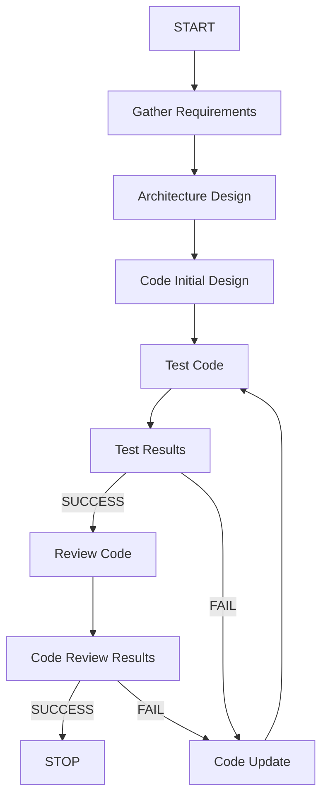

A project usually involves the following stages:

1. Gather requirements.
2. Architect the design.
3. Code and implement the design or changes.
4. Test the code.
5. If success proceed to next step. If failue, update code and test the code again. 
6. Review the code.
7. If success proceed to next step. If failure, upodate code and test the code again.

## Flowhchart

A step may request to update memory, if yes then update the memory via team member. MUST only update memory when explicitly asked to memorize, remember etc.

These steps can be invoked from any other step in any stage of a product design. The code, test and review steps may form multiple cycles. 
