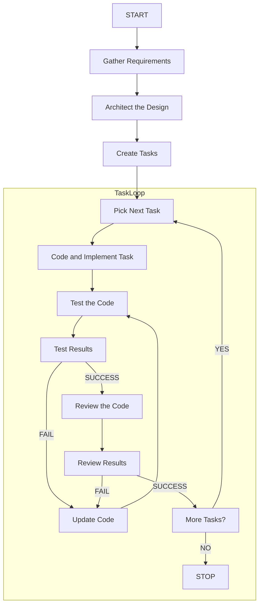

A project usually involves the following stages:

1. Gather requirements.
2. Architect the design.
3. Create tasks
4. Pick the first task 
5. Code and implement according to task description.
6. Test the code.
7. If successful, proceed to the next step. If failure, update code and test the code again. 
8. Review the code. 
9. If successful, proceed to the next step. If failure, update code and test the code again.
10. Pick the next task and repeat steps 5 to 9 until no more tasks are left to be implemented.

## Flowchart

A step may request to update memory, if yes then update the memory via team member. MUST only update memory when explicitly asked to memorize, remember etc.

These steps can be invoked from any other step in any stage of a product design. The code, test and review steps may form multiple cycles. 
