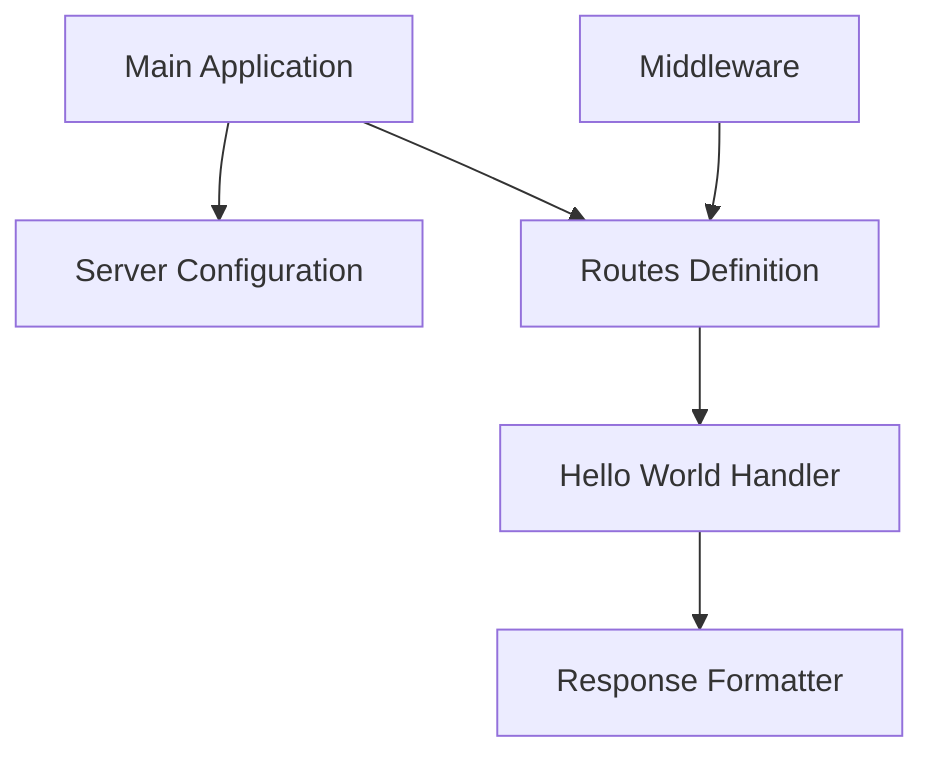

# System Patterns: Simple Rust API with Hello World Endpoint

## System Architecture
The architecture for this simple Rust API follows a clean, layered approach that separates concerns while maintaining simplicity:

```
┌─────────────────┐
│    HTTP Layer   │ ← Handles incoming HTTP requests and response formatting
└────────┬────────┘
         │
         ▼
┌─────────────────┐
│   Route Layer   │ ← Defines API endpoints and routes requests to handlers
└────────┬────────┘
         │
         ▼
┌─────────────────┐
│  Handler Layer  │ ← Contains business logic for processing requests
└────────┬────────┘
         │
         ▼
┌─────────────────┐
│  Response Layer │ ← Formats and returns appropriate responses
└─────────────────┘
```

This layered architecture, while perhaps more than strictly necessary for a "Hello World" endpoint, provides a solid foundation that can be extended as the API grows in complexity.

## Key Technical Decisions

### 1. Web Framework Selection
We will use **Actix Web** as our web framework for the following reasons:
- Mature ecosystem with excellent documentation
- High performance (consistently ranks among the fastest web frameworks)
- Strong community support
- Ergonomic API design that aligns well with Rust idioms
- Built-in support for async/await

Alternative options considered:
- **Rocket**: More ergonomic but slightly less performant
- **Warp**: Highly performant but steeper learning curve
- **Axum**: Newer framework with growing adoption but less mature

### 2. Response Format
The API will return plain text "Hello World" by default, with the option to return JSON if specified via an Accept header or query parameter. This demonstrates content negotiation while keeping the implementation simple.

### 3. Error Handling Strategy
Even for this simple API, we'll implement a consistent error handling pattern using Rust's Result type and custom error types. This establishes good practices for extension.

### 4. Configuration Management
Server configuration (port, host, etc.) will be managed through environment variables with sensible defaults, following the 12-factor app methodology.

## Design Patterns in Use

### 1. Dependency Injection
The application will use a lightweight form of dependency injection to make components testable and loosely coupled.

### 2. Builder Pattern
The server configuration will use the builder pattern for a clean, fluent API to set up the server.

### 3. Factory Pattern
Response creation will use a factory pattern to generate appropriate responses based on request parameters.

### 4. Middleware Pattern
The API will leverage middleware for cross-cutting concerns like logging and error handling.

## Component Relationships



The main application initializes the server configuration and routes definition. Routes direct requests to the appropriate handler (in this case, just the Hello World handler), which then uses the response formatter to generate the response. Middleware components can intercept requests before they reach the routes.

## Critical Implementation Paths

### 1. Server Initialization
```
main() → configure_app() → setup_routes() → start_server()
```

### 2. Request Processing
```
incoming_request → middleware_processing → route_matching → hello_world_handler → response_generation → client
```

### 3. Error Handling Path
```
error_occurrence → error_conversion → error_response_generation → client
```

## Performance Considerations

Even for this simple API, we'll establish patterns for performance:

1. **Connection Pooling**: Configure appropriate connection handling
2. **Timeouts**: Implement reasonable request timeouts
3. **Resource Limits**: Set appropriate limits on request size and rate

## Security Patterns

Basic security patterns will be established:

1. **Input Validation**: Validate any input parameters
2. **Headers Security**: Set appropriate security headers
3. **Rate Limiting**: Implement basic rate limiting

These system patterns provide a foundation that balances simplicity with best practices, allowing the API to serve as both a learning tool and a template for more complex implementations.
