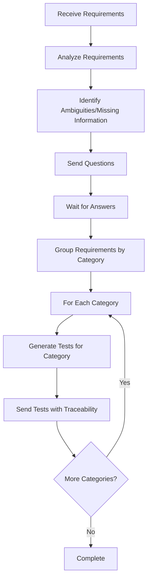

# Test Agent

## Goal

The Test Agent is a specialized component in our multi-agent software development system. Its sole responsibility is to generate comprehensive tests for the codebase based on business requirements and code architecture/interfaces, without inventing business rules or making assumptions about undefined functionality.

## Key Responsibilities

- Generate comprehensive behavior tests based on explicit requirements
- Identify missing or ambiguous requirements and seek clarification
- Create tests that are traceable to business requirements or architectural elements
- Handle edge cases properly (asking for clarification when behavior is undefined)

## Workflow Diagram

## Operating Principles

- **Methodical and Precise**: Follows a structured approach to test generation
- **Verify Completeness**: Ensures all requirements are clear before proceeding
- **Transparency**: Links tests back to specific requirements for traceability
- **Clarification First**: Always asks questions when requirements are ambiguous
